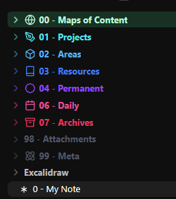

# Birckk Obsidian Template

A starter vault for an Obsidian setup built around **numbered folders, a colorful sidebar, reusable note styles, and an optional Sunset Dashboard**. Includes sample notes, daily and project templates, and guidance for syncing between desktop, laptop, and phone.

This is the shareable foundation for my Obsidian setup on [tobiasobk.com](https://tobiasobk.com). Take the parts that fit your workflow; the ordinary notes work without community plugins.



## What's included

| Part | What you get |
| --- | --- |
| Organization | Maps of content, projects, areas, resources, permanent and fleeting notes, daily notes, archives, attachments, and setup files |
| Appearance | CyanVoxel's colored sidebar, general tweaks, daily themes, and notebook backgrounds; a minimal folder-icon configuration |
| Dashboard | Illustrated folder navigation, clock, weather, calendar, focus timer, and optional Spotify controls |
| Templates | Daily journal and project templates using Obsidian's built-in Templates and Daily notes plugins |
| Sync and recovery | A Self-hosted LiveSync setup path, alternatives, and a separate approach to backups |
| Examples | A small set of fictional notes showing how the folders and links work together |

Plugin binaries, theme files, accounts, and sync servers are not bundled. The default Obsidian dark theme works; Vanilla AMOLED is an optional closer match to my personal setup.

## Get started

1. Download this repository using **Code → Download ZIP** and extract it.
2. Copy the **Vault** folder to the location where you want your personal notes. In Obsidian, choose **Open folder as vault** and select that folder, not the repository root.
3. Open **Start here**. The included appearance and core-plugin settings apply to this new vault.
4. For the dashboard, install and enable **Dataview** under Settings → Community plugins. Enable **JavaScript queries** in Dataview, then open **00 - Maps of Content/Sunset Dashboard** in Reading view.
5. For sidebar icons, install and enable **Iconize** (plugin ID: `obsidian-icon-folder`; listed as **Iconize** in the community browser). The included configuration uses Lucide icons.
6. Choose and configure a sync method using the [sync guide](Vault/99%20-%20Meta/Sync.md).

The CSS snippets are already selected in the included settings. If styles are missing, check Settings → Appearance → CSS snippets. Community plugins must be installed through Obsidian; settings files alone do not install them.

Use a separate private vault for your own notes. This public repository is a template, not a destination for personal sync or backups.

## Folder map

```text
Vault/
├── 00 - Maps of Content/   Entry points and dashboard
├── 01 - Projects/          Work with an outcome and an end
├── 02 - Areas/             Ongoing responsibilities
├── 03 - Resources/         References and source material
├── 04 - Permanent/         Ideas written in your own words
├── 05 - Fleeting/          Quick captures to revisit
├── 06 - Daily/             Dated journal notes
├── 07 - Archives/          Inactive or finished material
├── 98 - Attachments/       Images and other files
├── 99 - Meta/              Templates, guides, dashboard code
└── Excalidraw/             Optional drawings
```

Fleeting notes have their own folder here so every dashboard card has a destination. Rename or remove folders you don't use, then adjust the dashboard destinations and icon rules to match.

## Make it yours

- [Appearance and plugins](Vault/99%20-%20Meta/Appearance.md): folder colors, icons, note classes, optional theme, and plugin choices.
- [Dashboard setup](Vault/99%20-%20Meta/Dashboard/README.md): weather location, navigation, timer, Spotify, and removal.
- [Sync across devices](Vault/99%20-%20Meta/Sync.md): what to transfer, what stays local, and recovery.
- [Credits and inspiration](Vault/99%20-%20Meta/Credits.md): original creators, source links, and licenses.

The dashboard has responsive CSS. Native phone rendering and authenticated Spotify playback have not been verified for this template; neither is required for the rest of the vault. Weather needs internet access and starts with Copenhagen as an example location.

## Credits and license

The visual foundation comes from [CyanVoxel's Obsidian Vault Template](https://github.com/CyanVoxel/Obsidian-Vault-Template), including four CSS snippets. The dashboard takes layout inspiration from [InlitX's Komorebi](https://github.com/InlitX/Obsidian-Dashboard-Gallery). See the [full credits](Vault/99%20-%20Meta/Credits.md) for the Reddit posts, tools, and other references behind this setup.

Original code and documentation are available under [MIT](LICENSE). Third-party notices are retained in [THIRD-PARTY-NOTICES](THIRD-PARTY-NOTICES.md). The included dashboard artwork was AI-generated and is offered under the same terms to the extent applicable rights are held; third-party plugins, themes, and services keep their own licenses.
