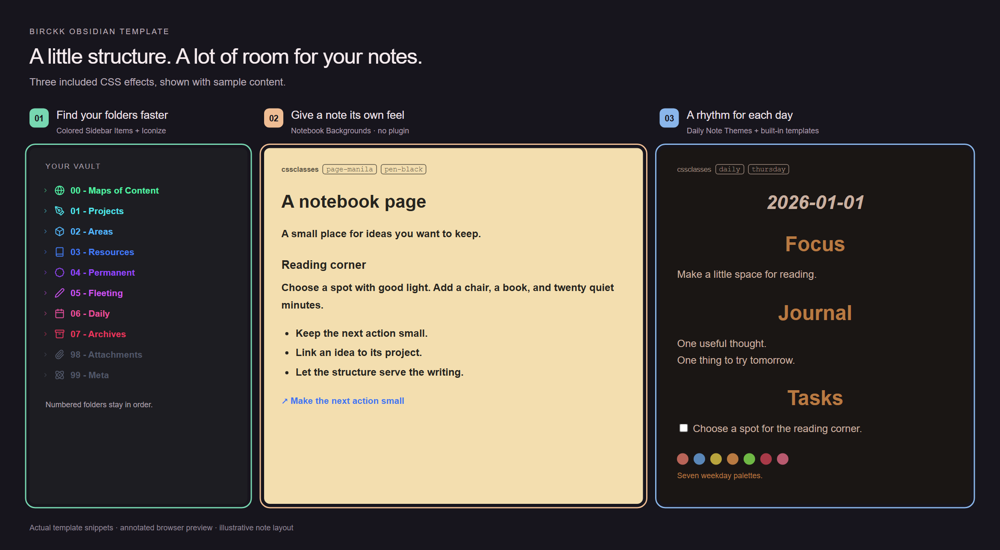

# Birckk Obsidian Template

**An example vault with colorful folders, styled notes, daily/project templates, an optional dashboard, and setup guides.** Copy it, open it in Obsidian, and make it yours.

| In the box | Start here |
| --- | --- |
| 🗂️ Numbered folders + linked example notes | [Explore the vault](Vault/Start%20here.md) |
| ✍️ Daily + project templates, five CSS snippets | [Appearance & plugins](Vault/99%20-%20Meta/Appearance.md) |
| 🌅 Sunset Dashboard + original artwork | [Dashboard setup](Vault/99%20-%20Meta/Dashboard/README.md) |
| 🔄 Sync choices + backup guidance | [Desktop, laptop & phone](Vault/99%20-%20Meta/Sync.md) |

## A home for your notes

Browse folders, check the weather, or start a timer. **Requires Dataview + JavaScript queries.** Spotify is optional.

Browser preview of the included dashboard, using demo weather.

## What the styling changes

**①** Sidebar colors and icons · **②** Per-note paper and pen colors · **③** Seven weekday palettes.

Annotated browser preview using the included CSS and an illustrative note layout. These previews are not native Obsidian screenshots.

## Try it in three steps

1. [Download ZIP](https://github.com/Bircck/Birckk-ObsidianTemplate/archive/refs/heads/main.zip), extract it, and copy **Vault** to your own notes location.
2. In Obsidian, **Open folder as vault** → select **Vault** → open **Start here**. The snippets are already selected under **Appearance → CSS snippets**.
3. Install only the extras you want below. Open the dashboard in **Reading view**.

## Which plugins do I need?

| I want… | Install / enable |
| --- | --- |
| 🗂️ Folders, colors & notebook styles | **Nothing extra** — included CSS |
| ✍️ Daily & project templates | **Daily notes + Templates** — built in, already enabled |
| 🌅 Dashboard | **Dataview** → enable **JavaScript queries** |
| ◇ Sidebar icons | **Iconize** → included folder rules |
| 🔄 Sync between devices | **Choose one sync method** — [guide](Vault/99%20-%20Meta/Sync.md) |
| 🎵 Spotify controls | **Spotify Control** — account setup and Premium requirements apply |

Optional: **Calendar** for daily-note navigation · **Tasks** for task queries · **Excalidraw** for sketches · **Homepage** to open your dashboard on launch. [Plugin links & details →](Vault/99%20-%20Meta/Appearance.md)

The default dark theme works; **Vanilla AMOLED** is optional. Plugins and accounts are configured separately. Native mobile behavior and authenticated Spotify playback are not verified. Keep personal notes and backups separate from this public repository.

## Made from good ideas

Built on [CyanVoxel's vault styling](https://github.com/CyanVoxel/Obsidian-Vault-Template), with dashboard inspiration from [InlitX / Komorebi](https://github.com/InlitX/Obsidian-Dashboard-Gallery). [All credits & inspiration →](Vault/99%20-%20Meta/Credits.md)

[MIT license](LICENSE) · [Third-party notices](THIRD-PARTY-NOTICES.md) · [My website](https://tobiasobk.com)
