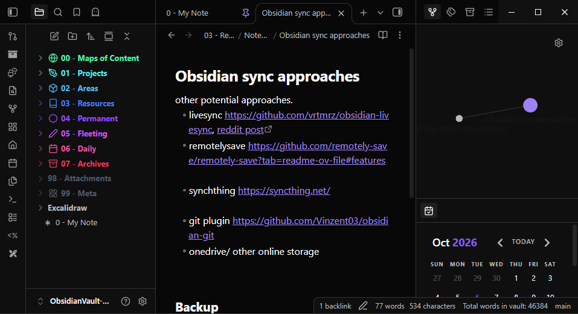
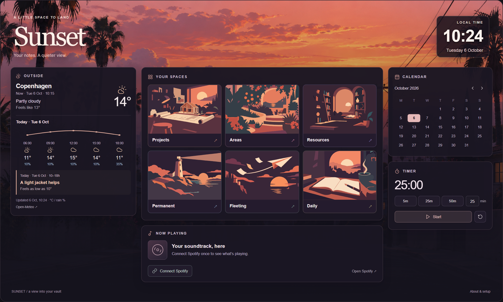

# Birckk Obsidian Template

**An example vault with colorful folders, styled notes, daily/project templates, and setup/sync guides.** Copy it, open it in Obsidian, and make it yours.

| In the box | Start here |
| --- | --- |
| 🗂️ Numbered folders + linked example notes | [Explore the vault](Vault/Start%20here.md) |
| ✍️ Daily + project templates, five CSS snippets | [Appearance & plugins](Vault/99%20-%20Meta/Appearance.md) |
| 🔄 Sync choices + backup guidance | [Desktop, laptop & phone](Vault/99%20-%20Meta/Sync.md) |

## What it looks like in Obsidian

**Colored folders** — included CSS · **Folder icons** — Iconize · **Calendar sidebar** — optional Calendar plugin.

Screenshot of my own vault with a sync reference note, using Vanilla AMOLED. Notebook and weekday note styles are also included; see the [appearance guide](Vault/99%20-%20Meta/Appearance.md).

## Try it in three steps

1. [Download ZIP](https://github.com/Bircck/Birckk-ObsidianTemplate/archive/refs/heads/main.zip), extract it, and copy **Vault** to your own notes location.
2. In Obsidian, **Open folder as vault** → select **Vault** → open **Start here**. The snippets are already selected under **Appearance → CSS snippets**.
3. Start writing, or use **Daily notes** and **Templates** to create your first note. Add only the extras you want below.

## Which plugins do I need?

| I want… | Install / enable |
| --- | --- |
| 🗂️ Folders, colors & notebook styles | **Nothing extra** — included CSS |
| ✍️ Daily & project templates | **Daily notes + Templates** — built in, already enabled |
| ◇ Sidebar icons | **Iconize** → included folder rules |
| 🔄 Sync between devices | **Choose one sync method** — [guide](Vault/99%20-%20Meta/Sync.md) |

Optional: **Calendar** for daily-note navigation · **Tasks** for task queries · **Excalidraw** for sketches · **Homepage** to open a chosen note on launch. [Plugin links & details →](Vault/99%20-%20Meta/Appearance.md)

The default dark theme works; **Vanilla AMOLED** is optional. Plugins and accounts are configured separately. Keep personal notes and backups separate from this public repository.

## Made from good ideas

Built on [CyanVoxel's vault styling](https://github.com/CyanVoxel/Obsidian-Vault-Template). [All credits & inspiration →](Vault/99%20-%20Meta/Credits.md)

[MIT license](LICENSE) · [Third-party notices](THIRD-PARTY-NOTICES.md) · [My website](https://tobiasobk.com)

## Optional extra: Sunset Dashboard

A visual start page with folder cards, weather, a calendar, and a timer. The folders, templates, and note styles work without it.

**Requires Dataview → JavaScript queries.** Open the dashboard in **Reading view**. [Setup & customization →](Vault/99%20-%20Meta/Dashboard/README.md)

Spotify controls additionally require **Spotify Control**, account setup, and Premium. Native mobile behavior and authenticated Spotify playback are not verified.

Browser preview using demo weather. Layout inspired by [InlitX / Komorebi](https://github.com/InlitX/Obsidian-Dashboard-Gallery).
